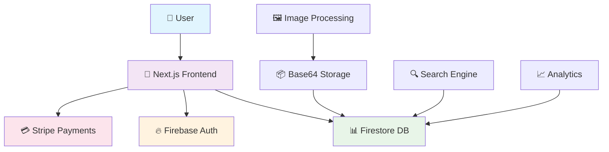

<div align="center">

# 🌱 EcoFinds - Sustainable Marketplace 🌍


[](https://nextjs.org/)
[](https://www.typescriptlang.org/)
[](https://firebase.google.com/)
[](https://tailwindcss.com/)
[](https://stripe.com/)


### 🌟 *Where Sustainability Meets Innovation* 🌟

</div>

---

## 🌍 **About EcoFinds**

> **EcoFinds** is a revolutionary sustainable marketplace that connects eco-conscious consumers with environmentally friendly products. Our platform empowers individuals to make sustainable choices while supporting green businesses and reducing environmental impact.

<div align="center">

```
🌱 Sustainable Products + 💚 Conscious Community = 🌍 Better Planet
```

</div>

### ✨ **Why EcoFinds?**

- 🌿 **Curated Eco Products** - Only verified sustainable and eco-friendly items
- 🔍 **Smart Discovery** - AI-powered recommendations for sustainable alternatives  
- 📊 **Impact Tracking** - See your environmental impact with every purchase
- 🤝 **Community Driven** - Connect with like-minded eco-warriors
- 📱 **Mobile First** - Seamless experience across all devices
- 🔒 **Secure & Trusted** - Enterprise-grade security and payment processing

---

## 🚀 **Features**

<div align="center">

| 🎯 Feature | 📱 Mobile | 💻 Desktop | 🌟 Status |
|------------|-----------|------------|-----------|
| 🛍️ **Product Browsing** | ✅ Optimized | ✅ Enhanced | 🟢 Live |
| 🔍 **Smart Search** | ✅ Touch-friendly | ✅ Advanced filters | 🟢 Live |
| 🛒 **Shopping Cart** | ✅ Swipe actions | ✅ Bulk operations | 🟢 Live |
| 🔐 **Authentication** | ✅ Biometric | ✅ Multi-factor | 🟢 Live |
| 💳 **Payments** | ✅ Mobile wallets | ✅ All methods | 🟢 Live |
| 📊 **Analytics** | ✅ Quick stats | ✅ Detailed reports | 🟢 Live |
| 🌱 **Impact Tracker** | ✅ Visual metrics | ✅ Detailed insights | 🟢 Live |

</div>

### 🎨 **User Experience Highlights**

- **🎯 Intuitive Navigation** - Clean, modern interface with smooth animations
- **⚡ Lightning Fast** - Optimized performance with lazy loading and caching
- **🎨 Beautiful Design** - Gradient themes and micro-interactions
- **♿ Accessible** - WCAG 2.1 compliant for all users
- **🌐 Responsive** - Perfect experience on any screen size

---

## 🛠️ **Tech Stack**

<div align="center">

### 🏗️ **Architecture Overview**



</div>

### 🎯 **Frontend**
- **⚛️ Next.js 13+** - React framework with App Router
- **🎨 Tailwind CSS** - Utility-first CSS framework
- **📱 TypeScript** - Type-safe development
- **🎭 Framer Motion** - Smooth animations and transitions
- **🎪 Lucide Icons** - Beautiful, consistent iconography

### 🔥 **Backend & Services**
- **🔥 Firebase** - Authentication and real-time database
- **📊 Firestore** - NoSQL document database
- **💳 Stripe** - Secure payment processing
- **🖼️ Image Optimization** - Automatic compression and base64 encoding
- **📧 Email Service** - Automated notifications and receipts

### 🚀 **Deployment & DevOps**
- **▲ Vercel** - Edge deployment and hosting
- **🔄 GitHub Actions** - CI/CD pipeline
- **📊 Analytics** - Performance and user behavior tracking
- **🛡️ Security** - Environment variables and API protection

---

## 📱 **Screenshots**

<div align="center">

### 🏠 **Homepage Experience**

```
┌─────────────────────────────────────────────────────────────┐
│  🌱 EcoFinds                    🔍 Search...     👤 Profile │
│  ═══════════════════════════════════════════════════════════ │
│                                                             │
│  🌟 Discover Sustainable Living                            │
│  Find eco-friendly products and connect with conscious     │
│  sellers in our green marketplace                          │
│                                                             │
│  ┌─────────────┐ ┌─────────────┐ ┌─────────────┐          │
│  │ 🌿 Organic  │ │ ♻️ Recycled │ │ 🌱 Bamboo   │          │
│  │ Skincare    │ │ Clothing    │ │ Utensils    │          │
│  │             │ │             │ │             │          │
│  │ $29.99      │ │ $45.50      │ │ $19.99      │          │
│  │ [Add to 🛒] │ │ [Add to 🛒] │ │ [Add to 🛒] │          │
│  └─────────────┘ └─────────────┘ └─────────────┘          │
└─────────────────────────────────────────────────────────────┘
```

### 📱 **Mobile Layout (2 Products per Row)**

```
┌─────────────────────────┐
│ 🌱 EcoFinds      ☰ Menu │
│ ═══════════════════════ │
│                         │
│ 🔍 [Search products...] │
│                         │
│ ┌─────────┐ ┌─────────┐ │
│ │ 🌿 Eco  │ │ ♻️ Recy │ │
│ │ Product │ │ Product │ │
│ │         │ │         │ │
│ │ $29.99  │ │ $45.50  │ │
│ │ [🛒 Add]│ │ [🛒 Add]│ │
│ └─────────┘ └─────────┘ │
│                         │
│ ┌─────────┐ ┌─────────┐ │
│ │ 🌱 Orga │ │ 💚 Sust │ │
│ │ Product │ │ Product │ │
│ │         │ │         │ │
│ │ $19.99  │ │ $35.00  │ │
│ │ [🛒 Add]│ │ [🛒 Add]│ │
│ └─────────┘ └─────────┘ │
└─────────────────────────┘
```

</div>

---

## ⚡ **Quick Start**

### 📋 **Prerequisites**

```bash
Node.js 18.0+ ✅
npm or yarn ✅
Git ✅
```

### 🚀 **Installation**

```bash
# 1️⃣ Clone the repository
git clone https://github.com/yourusername/ecofinds.git
cd ecofinds

# 2️⃣ Install dependencies
npm install
# or
yarn install

# 3️⃣ Set up environment variables
cp .env.example .env.local

# 4️⃣ Configure your environment
# Edit .env.local with your API keys (see Configuration section)

# 5️⃣ Run the development server
npm run dev
# or
yarn dev

# 🎉 Open http://localhost:3000
```

### 🔧 **Environment Configuration**

Create a `.env.local` file with the following variables:

```env
# 🔥 Firebase Configuration
NEXT_PUBLIC_FIREBASE_API_KEY=your_firebase_api_key
NEXT_PUBLIC_FIREBASE_AUTH_DOMAIN=your_project.firebaseapp.com
NEXT_PUBLIC_FIREBASE_PROJECT_ID=your_project_id
NEXT_PUBLIC_FIREBASE_STORAGE_BUCKET=your_project.appspot.com
NEXT_PUBLIC_FIREBASE_MESSAGING_SENDER_ID=your_sender_id
NEXT_PUBLIC_FIREBASE_APP_ID=your_app_id

# 💳 Stripe Configuration
NEXT_PUBLIC_STRIPE_PUBLISHABLE_KEY=pk_test_...
STRIPE_SECRET_KEY=sk_test_...

# 🌐 App Configuration
NEXT_PUBLIC_APP_URL=http://localhost:3000
```

---

## 📁 **Project Structure**

```
🌱 EcoFinds/
├── 📱 app/                     # Next.js 13+ App Router
│   ├── 🏠 page.tsx            # Homepage with product grid
│   ├── 🛒 cart/               # Shopping cart functionality
│   ├── 💳 checkout/           # Payment processing
│   ├── 📦 listings/           # Product management
│   │   ├── add/               # Add new products
│   │   └── edit/[id]/         # Edit existing products
│   ├── 🔐 login/              # User authentication
│   ├── ✍️ signup/             # User registration
│   ├── 👤 dashboard/          # User dashboard
│   └── 📊 purchases/          # Order history
├── 🎨 components/             # Reusable UI components
│   ├── 🧩 Layout/            # Header, Footer, Navigation
│   ├── 📦 Product/           # Product cards, forms, details
│   ├── 🛒 Cart/              # Shopping cart components
│   ├── 🔐 Auth/              # Authentication forms
│   └── 🎯 Shared/            # Common UI elements
├── 🔧 lib/                    # Utility functions & configs
│   ├── 🔥 firebase.ts        # Firebase configuration
│   ├── 📊 types.ts           # TypeScript definitions
│   ├── 🛠️ utils.ts           # Helper functions
│   └── 📦 addproduct.ts      # Product management logic
├── 🎯 context/               # React Context providers
│   ├── 🔐 AuthContext.tsx    # Authentication state
│   └── 🛒 CartContext.tsx    # Shopping cart state
├── 🎨 styles/                # Global styles
│   └── globals.css           # Tailwind CSS imports
└── 🌐 public/                # Static assets
    ├── 🎨 favicon.ico        # Website favicon
    └── 📸 images/            # Static images
```

---

## 🌟 **Key Features Deep Dive**

### 🛍️ **Smart Product Discovery**
- **🔍 Advanced Search**: Filter by category, price, sustainability score
- **🏷️ Smart Categories**: Organized eco-friendly product categories
- **⭐ Community Ratings**: User reviews and sustainability scores
- **📊 Impact Metrics**: CO₂ saved, water conserved, waste reduced

### 📱 **Mobile-Optimized Experience**
- **📲 Responsive Grid**: 2 products per row on mobile, 4 on desktop
- **👆 Touch-Friendly**: Optimized button sizes and spacing
- **⚡ Fast Loading**: Image compression and lazy loading
- **🎨 Smooth Animations**: Micro-interactions and transitions

### 🔐 **Secure Authentication**
- **🔑 Multiple Options**: Email/password and Google OAuth
- **👤 User Profiles**: Personalized dashboards and preferences
- **🛡️ Security First**: Firebase Auth with industry standards
- **📊 Activity Tracking**: Purchase history and impact metrics

### 💳 **Seamless Payments**
- **💰 Stripe Integration**: Secure, PCI-compliant payment processing
- **🛒 Smart Cart**: Persistent cart across sessions
- **📧 Order Management**: Email confirmations and tracking
- **🔄 Purchase History**: Complete order tracking and receipts

---

## 🌍 **Environmental Impact**

<div align="center">

### 📊 **Our Community's Impact**

| 🎯 **Metric** | 📈 **This Month** | 🏆 **All Time** | 🎯 **Goal** |
|---------------|-------------------|------------------|--------------|
| 🌳 **CO₂ Saved** | 847 kg | 12,450 kg | 50,000 kg |
| 💧 **Water Conserved** | 2,340 L | 28,920 L | 100,000 L |
| ♻️ **Items Recycled** | 156 | 1,847 | 10,000 |
| 🌱 **Eco Products Sold** | 89 | 1,234 | 5,000 |

</div>

### 🎯 **Sustainability Features**
- **📊 Impact Calculator**: Real-time environmental impact tracking
- **🏆 Eco Badges**: Gamification for sustainable choices
- **📈 Progress Tracking**: Personal and community sustainability metrics
- **🌱 Carbon Footprint**: Detailed breakdown of environmental savings

---

## 🤝 **Contributing**

We welcome contributions from the community! 💚

### 🎯 **How to Contribute**

1. **🍴 Fork the repository**
2. **🌿 Create a feature branch**: `git checkout -b feature/amazing-feature`
3. **💻 Make your changes**
4. **✅ Test thoroughly**
5. **📝 Commit your changes**: `git commit -m "✨ Add amazing feature"`
6. **🚀 Push to branch**: `git push origin feature/amazing-feature`
7. **🔄 Open a Pull Request**

### 📋 **Contribution Guidelines**
- Follow the existing code style and conventions
- Write clear, descriptive commit messages
- Add tests for new features
- Update documentation as needed
- Ensure mobile responsiveness for UI changes

### 🐛 **Bug Reports**
Found a bug? Please open an issue with:
- Clear description of the problem
- Steps to reproduce
- Expected vs actual behavior
- Screenshots if applicable
- Environment details (browser, device, etc.)

---

## 📄 **License**

This project is licensed under the **MIT License** - see the [LICENSE](LICENSE) file for details.

---

## 🙏 **Acknowledgments**

<div align="center">

### 💚 **Special Thanks**

- 🌱 **The Sustainability Community** - For inspiring eco-conscious living
- ⚛️ **Next.js Team** - For the incredible React framework
- 🔥 **Firebase Team** - For powerful backend services
- 🎨 **Tailwind CSS** - For making styling enjoyable
- 💳 **Stripe** - For secure payment processing
- 🌍 **All Contributors** - For making this project possible

</div>

---

## 📞 **Connect With Us**

<div align="center">

[](https://ecofinds.com)
[](mailto:hello@ecofinds.com)
[](https://twitter.com/ecofinds)
[](https://linkedin.com/company/ecofinds)
[](https://discord.gg/ecofinds)

</div>

---

<div align="center">

## 🌟 **Show Your Support**

If you find EcoFinds helpful, please consider:

⭐ **Starring this repository**  
🐦 **Sharing on social media**  
🤝 **Contributing to the project**  
💚 **Spreading the word about sustainable living**

---

### 🌱 **Together, We Can Build a Sustainable Future** 🌍


---

*© 2024 EcoFinds. Made with 💚 for a sustainable planet.*

</div>